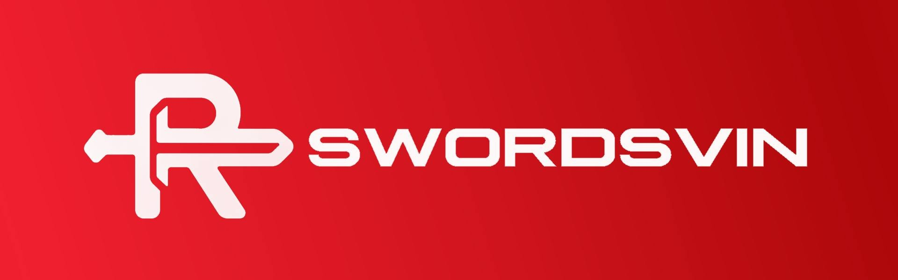

<p align="center">
  
</p>

<p align="center">
  <a href="https://github.com/SvinDev/Relazin/actions/workflows/build.yml"></a>
  <a href="https://github.com/SvinDev/Relazin/releases"></a>
  <a href="LICENSE"></a>
</p>

# Relazin

Relazin is an experimental iOS customization toolbox that combines the Lara core with the Cyanide tweak engine behind a terminal-inspired SwiftUI interface.

> [!WARNING]
> Relazin performs low-level system modifications. Compatibility depends on the device, iOS build, and available offsets. Back up important data and use it at your own risk.

## Features

- DarkSword-based exploit and kernel read/write integration
- SpringBoard and RemoteCall customization
- MobileGestalt, UI, font, passcode, app, and system tweaks
- App decryption, JIT enabling, OTA controls, and file utilities
- Runtime loading of custom `.js` and `.dylib` tweaks
- Respring and userspace restart tools

## Compatibility

The current interface targets iOS 17.0–18.7 and iOS 26.0–26.0.1. The Xcode target has a minimum deployment version of iOS 16.0, but that does not guarantee exploit or tweak support on every iOS 16 build. Apple A19 and M5 devices are not supported.

## Installation

1. Download the latest IPA from [Releases](https://github.com/SvinDev/Relazin/releases).
2. Sign and install it using your preferred iOS sideloading method.
3. Open Relazin and run the exploit before using features that require kernel access.

## Build

Requirements:

- macOS with the latest stable Xcode
- Homebrew
- `ldid`

```bash
brew install ldid
git clone https://github.com/SvinDev/Relazin.git
cd Relazin
./scripts/build_ipa.sh
```

The resulting package is written to `build/relazin.ipa`.

## Preview

nothing..

## Credits

- [SvinDev](https://github.com/SvinDev) — maintainer and Relazin integration
-
— 
- ChatGPT 5.6 Sol — development, integration, and CI debugging assistance

This project was developed with assistance from ChatGPT 5.6 Sol.

## License

Relazin is distributed under the [GNU Affero General Public License v3.0](LICENSE). Bundled third-party components retain their respective licenses under [`relazin/licenses`](relazin/licenses).
